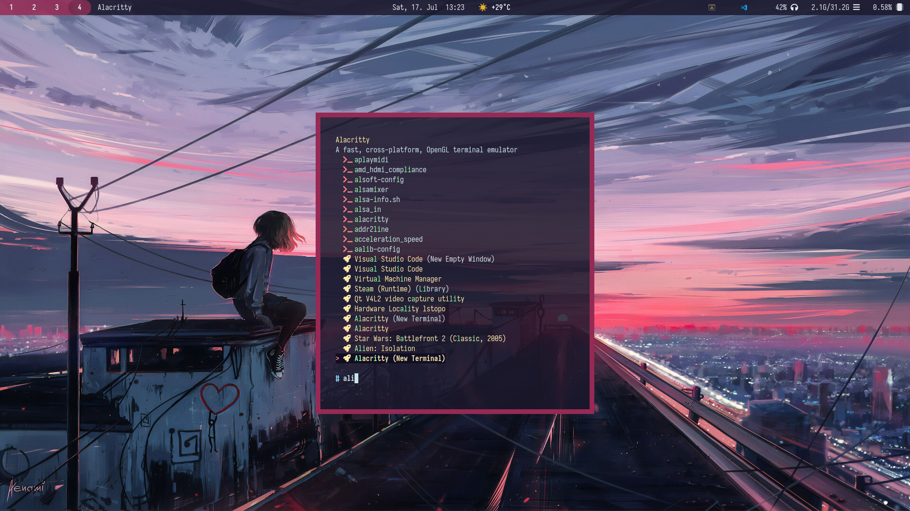
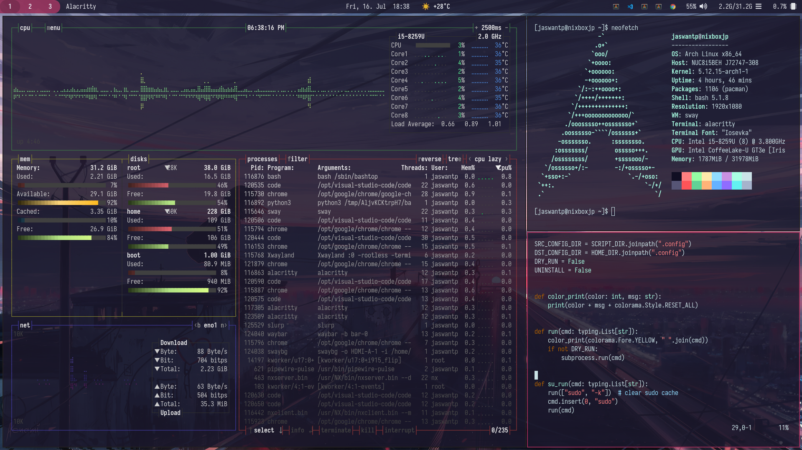

# Dotfiles for Sway.




I heavily recommend (if you actually want to use my configs) to fork this repository and change stuff according to your needs. 

Treat these dotfiles as a solid, sensible base package for your own dotfiles. Enjoy!

## My note

*Look at [SocketByte/dotfiles](https://github.com/SocketByte/dotfiles) for scripts to install Arch Linux and everything else to do with sway*

This fork assumes you've a functioning installation of Arch Linux with any DE/WM. 

It contains scripts and config files to rice (beautify) an existing 
arch linux installation without using yay or any AUR helper.

## Installation

First install Git and clone the repository using the command below.

```bash
$ pacman -S git
$ git clone https://github.com/jaswantp/dotfiles
```

Run the python script.
```bash
$ cd dotfiles
$ installer.py
```

## Tip
Use the `--dryrun` or `-n` argument to just observe the changes that will be made before you actually run the script.
Modify `installer.py` to your needs if necessary. Enjoy!


## To revert to sway default
```bash
$ installer.py --nodeps --uninstall
```

## If you find the default mundane, beautify again ;)
```bash
$ installer.py --nodeps --install
```

## If you want to fully uninstall everything inclusive of dependencies
```bash
$ installer.py --uninstall
```

## Features

- Sensible Sway configuration defaults with quality-of-life tweaks.
- Custom Waybar styling and configuration.
- Uses [sway-launcher-desktop](https://github.com/Biont/sway-launcher-desktop) from AUR powered by the amazing🔥 fuzzy search tool [fzf](https://github.com/junegunn/fzf)
- Alacritty styling and configuration.
- Matching wallpaper :)
- Notifications styled with [Mako](https://github.com/emersion/mako)
- Google chrome, VSCode, Discord, Alacritty.
